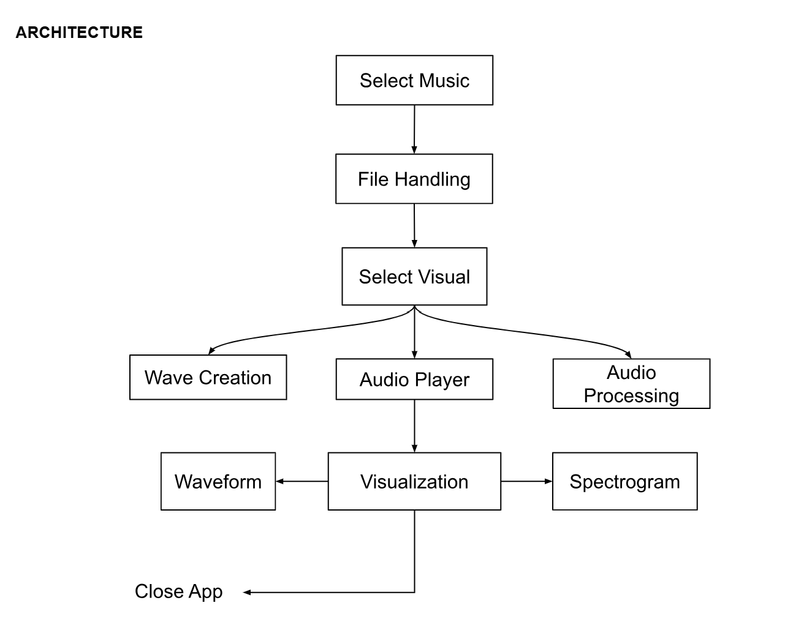

# Audio Visualizer
Windows application using the SFML to visualize audio amplitude and frequency.

## External Libraries
* SFML: https://www.sfml-dev.org/documentation/2.6.1/annotated.php
* Miniaudio: https://github.com/mackron/miniaudio 
* Win32 API: https://learn.microsoft.com/en-us/windows/win32/api/commdlg/ns-commdlg-openfilenamea
* Simple FFT: https://github.com/d1vanov/Simple-FFT 

## Licenses
This project is covered under MIT License in addition to other licenses provided by the external libraries.
